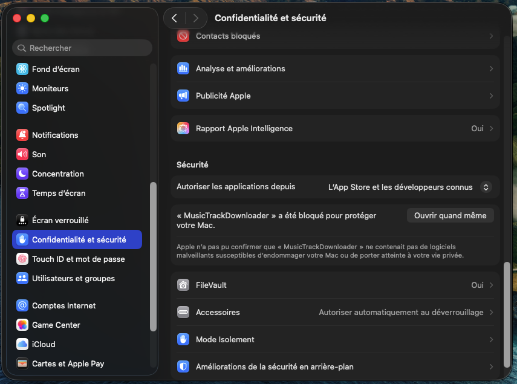
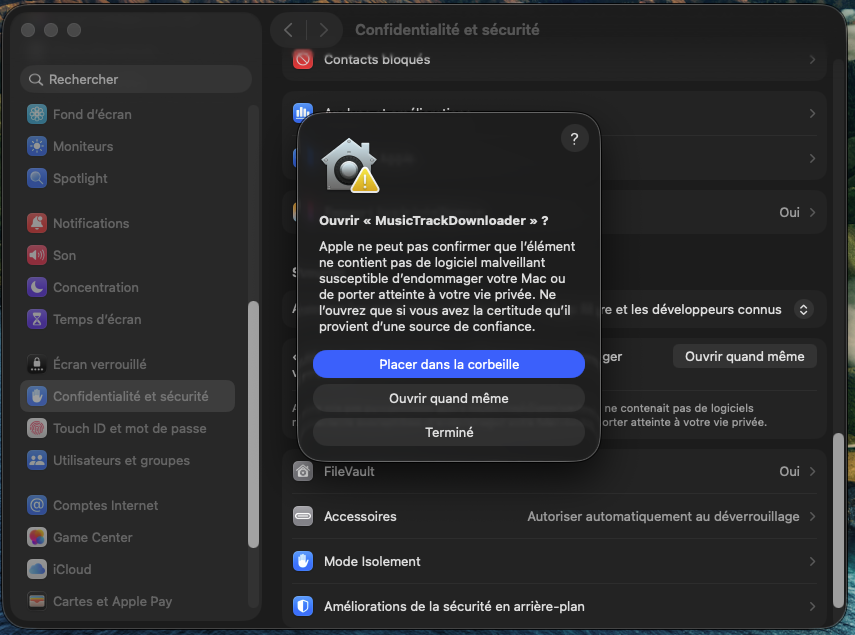

# Music Track Downloader

> **Personal / educational use only. Not for commercial use. No warranty.**  
> See [Legal & disclaimer](#legal--disclaimer) before downloading or using this software.

Desktop tool to download **music tracks and playlists** as audio files (e.g. for personal DJ / USB practice).

**For personal use only — for your own music** (content you own, created, or are allowed to copy). Not for commercial use.

**Version:** see [`VERSION`](VERSION) (shown in the app as `v…`)

**Supported today:** SoundCloud & YouTube (tracks + playlists)  
**Planned (maybe):** Deezer, Spotify  

---

## Legal & disclaimer

**Read this first.**

This project is provided **for fun, learning, and personal use only — for your own music**.

| Rule | Meaning |
|------|---------|
| **Your own music** | Use this for tracks you own, created, or have explicit permission to download/copy (e.g. your DJ sets, your uploads, licensed personal copies). |
| **No commercial use** | Do not sell, rent, license, or use this software (or files obtained with it) in any business, paid gig pipeline, shop, SaaS, or monetized workflow. |
| **No redistribution as a product** | Do not repackage or sell this app. Sharing the GitHub link with friends is fine; selling copies is not. |
| **You are responsible** | You alone decide what you download. You must comply with the terms of service of SoundCloud, YouTube, and any other site, plus copyright and local law. |
| **No piracy endorsement** | This tool does not grant you rights to content you do not already have the right to use. Prefer content you own, created, or are allowed to copy. |
| **No warranty** | Provided **“as is”**, without any warranty. The authors are **not liable** for account bans, takedowns, data loss, legal claims, or any other damage. |
| **Platform ToS** | Using unofficial download methods may violate third-party terms and can lead to account suspension. Use at your own risk. |

By downloading or using this software, you agree to these terms. If you do not agree, do not use it.

Full text: see [`LICENSE`](LICENSE).

---

## Download (ready-made builds)

Stable downloads are published on **GitHub Releases**.

### Latest release

**[→ All downloads (Releases)](https://github.com/emmanueldevins/Music-Track-Downloader/releases/latest)**

| Platform | File | Direct link |
|----------|------|-------------|
| **macOS** (Apple Silicon) | `MusicTrackDownloader-mac-arm64.zip` | [Download Mac](https://github.com/emmanueldevins/Music-Track-Downloader/releases/latest/download/MusicTrackDownloader-mac-arm64.zip) |
| **Windows** (64-bit) | `MusicTrackDownloader-win64.zip` | [Download Windows](https://github.com/emmanueldevins/Music-Track-Downloader/releases/latest/download/MusicTrackDownloader-win64.zip) |

> If a link 404s, wait for the CI build to finish, then refresh.

### Install notes

**macOS (important — Gatekeeper will block the app)**

Apple blocks apps that are not from the App Store / “identified developers”. This project is a personal / hobby app **without** an Apple Developer certificate, so macOS will show warnings such as:

- *« MusicTrackDownloader » a été bloqué pour protéger votre Mac*
- *« … est endommagé et ne peut pas être ouvert »*

That is **normal**, not a broken download.

#### Option A — Recommended (System Settings)

1. Download the Mac zip → unzip → `MusicTrackDownloader.app`
2. Try to open the app once (double-click). macOS will block it.
3. Open **Réglages Système → Confidentialité et sécurité**
4. Scroll to **Sécurité** — you should see a message that MusicTrackDownloader was blocked
5. Click **Ouvrir quand même**
6. In the confirmation dialog, click **Ouvrir quand même** again





#### Option B — Terminal (if the app still won’t open)

```bash
xattr -cr ~/Downloads/MusicTrackDownloader.app
open ~/Downloads/MusicTrackDownloader.app
```

(Adjust the path if you unzipped elsewhere.)

Files save to `~/Downloads/MusicTrackDownloader`.

**Windows**

1. Download the Windows zip → unzip → run `MusicTrackDownloader.exe`
2. SmartScreen: **More info → Run anyway**
3. Files save to `%USERPROFILE%\Downloads\MusicTrackDownloader`

### Updates

The app shows its version (`v1.1.0`, etc.) in the top-right.

**Update check runs when you launch the app** (after ~1 second).  
If a newer version exists on GitHub, you get:

1. A popup **« Mise à jour disponible »**
2. An orange banner under the title with a **Télécharger** button

You can also **click the version number** (`v1.1.2`) anytime to re-check.

> If the app was already open when a new version was published, **quit and reopen** it to see the update prompt.

---

## How builds get onto Releases

Every push to **`main`** runs GitHub Actions (**Build & Release**):

1. Builds **macOS** (Apple Silicon) and **Windows** in the cloud  
2. Publishes both zips to the **[Latest builds](https://github.com/emmanueldevins/Music-Track-Downloader/releases/latest)** release  

To ship updates: just **push to `main`**. CI auto-bumps the patch version (`1.1.0` → `1.1.1`), rebuilds Mac + Windows, and refreshes the Latest release. Old apps detect the new `VERSION` on GitHub and prompt to update.

Manual bump (optional): `python bump_version.py` or `python bump_version.py --set 2.0.0`

---

## Features

- Tracks **and** playlists  
- SoundCloud + YouTube (more platforms maybe later)  
- Optional browser login (Chrome / Edge / Firefox)  
- YouTube fallback when a SoundCloud track fails  
- Cover art when possible  
- Rate-limit aware SoundCloud downloads  
- Stop / skip existing / open folder when done  
- In-app version + update reminder  

---

## Build from source

### macOS app

```bash
./build_app.sh
```

Produces `dist/MusicTrackDownloader.app` and `dist/MusicTrackDownloader-mac-arm64.zip`.

### Windows app

Built automatically by CI on push to `main`. Manual: Actions → **Build & Release**, or on Windows `.\build_windows.ps1`.

### Dev GUI (Mac)

```bash
./download.sh gui
```

Requires Python 3.10+. Optional: `brew install ffmpeg deno`.

---

## Tips

| Tip | Why |
|-----|-----|
| Use **Chrome** logged into the service | Fewer blocks / better quality |
| Enable **Ignorer déjà téléchargés** on retry | Only missing tracks are fetched again |
| Large SoundCloud sets are slower on purpose | Avoids HTTP 429 |

---

## Roadmap

- [x] SoundCloud tracks & playlists  
- [x] YouTube tracks & playlists  
- [x] macOS + Windows packaging  
- [x] Version display + update check  
- [ ] Deezer (maybe)  
- [ ] Spotify (maybe)  

---

## Project layout

| Path | Role |
|------|------|
| `app_gui.py` | Desktop UI |
| `download_playlist.py` | Download engine |
| `version.py` / `VERSION` / `bump_version.py` | App name + auto version bump |
| `build_app.sh` | macOS package |
| `build_windows.ps1` | Windows package |
| `.github/workflows/build-and-release.yml` | Auto Mac + Windows build & release |
| `LICENSE` | Personal-use license / disclaimer |

---

## Contact / issues

Use [GitHub Issues](https://github.com/emmanueldevins/Music-Track-Downloader/issues) for bugs. This is a **hobby** project — no support SLA, no commercial offering.
